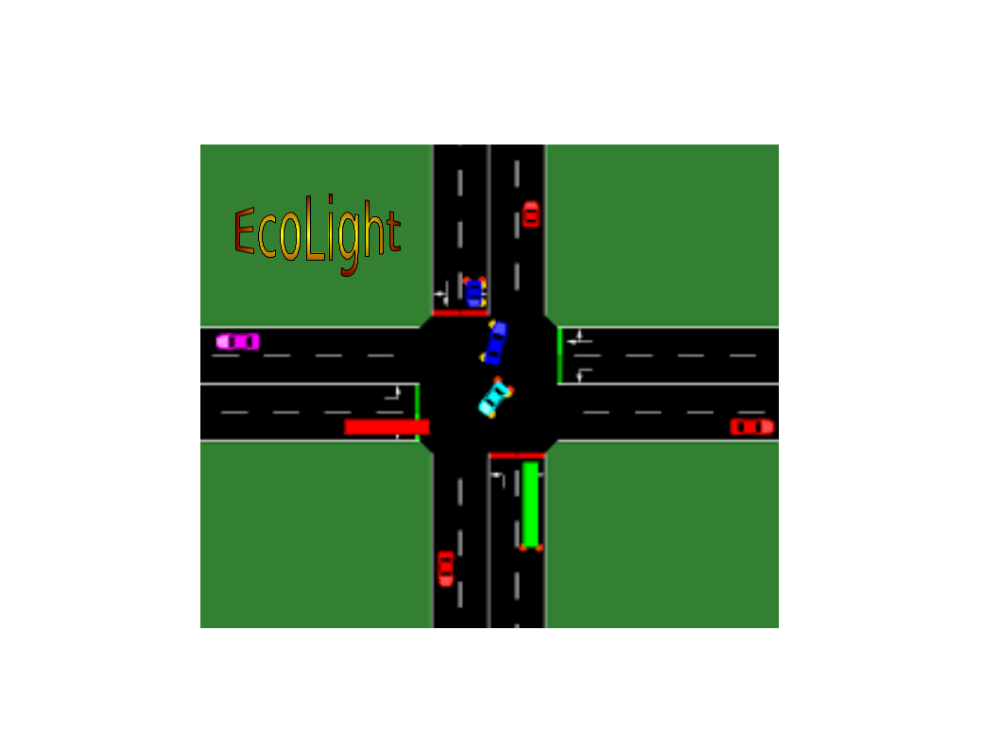
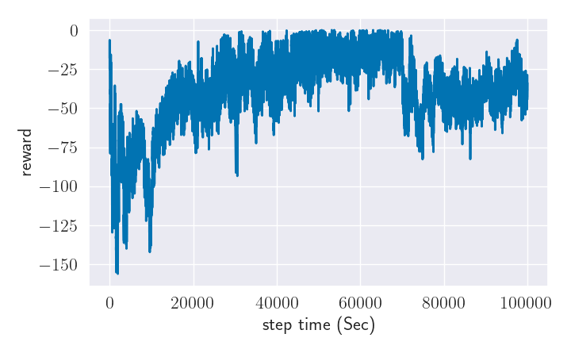
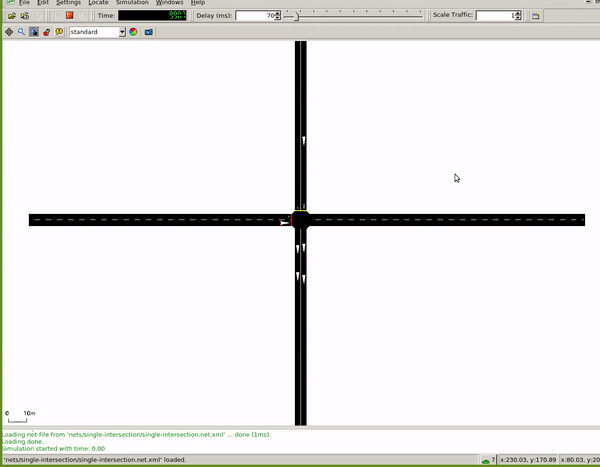

# EcoLight

EcoLight is a ecosystem friendly RL appraoch for traffic control signal. The code is based on [SUMO-RL](https://github.com/LucasAlegre/sumo-rl)

More information: https://upaspro.com/ecolight/

SUMO-RL provides a simple interface to instantiate Reinforcement Learning environments with [SUMO](https://github.com/eclipse/sumo) for Traffic Signal Control. 

The main class [SumoEnvironment](/sumo_rl/environment/env.py) inherits [MultiAgentEnv](https://github.com/ray-project/ray/blob/master/python/ray/rllib/env/multi_agent_env.py) from [RLlib](https://github.com/ray-project/ray/tree/master/python/ray/rllib).  
If instantiated with parameter 'single-agent=True', it behaves like a regular [Gym Env](https://github.com/openai/gym/blob/master/gym/core.py) from [OpenAI](https://github.com/openai).  
[TrafficSignal](https://github.com/LucasAlegre/sumo-rl/blob/master/environment/traffic_signal.py) is responsible for retrieving information and actuating on traffic lights using [TraCI](https://sumo.dlr.de/wiki/TraCI) API.

Goals of this repository:
- Provide a simple interface to work with Reinforcement Learning for Traffic Signal Control using SUMO
- Support Multiagent RL
- Compatibility with gym.Env and popular RL libraries such as [stable-baselines3](https://github.com/DLR-RM/stable-baselines3) and [RLlib](https://docs.ray.io/en/master/rllib.html)
- Easy customisation: state and reward definitions are easily modifiable

## Install

### Install SUMO latest version:

```
sudo add-apt-repository ppa:sumo/stable
sudo apt-get update
sudo apt-get install sumo sumo-tools sumo-doc 
```
Don't forget to set SUMO_HOME variable (default sumo installation path is /usr/share/sumo)
```
echo 'export SUMO_HOME="/usr/share/sumo"' >> ~/.bashrc
source ~/.bashrc
```

### Install SUMO-RL

Stable release version is available through pip
```
pip install sumo-rl
```

Alternatively you can install using the latest (unreleased) version
```
git clone https://github.com/LucasAlegre/sumo-rl
cd sumo-rl
pip install -e .
```
### Run EcoLight
```
git clone https://github.com/pagand/ecolight
cd ecolight
python3 run[...].py
```


## General Examples (SUMO-RL)

Check [experiments](/experiments) to see how to instantiate a SumoEnvironment and use it with your RL algorithm.

### [Q-learning](/sumo-rl/agents/ql_agent.py) in a one-way single intersection:
```
python3 experiments/ql_single-intersection.py 
```

### [RLlib A3C](/experiments/a3c_4x4grid.py) multiagent in a 4x4 grid:
```
python3 experiments/a3c_4x4grid.py
```

### [stable-baselines3 DQN](/experiments/dqn_2way-single-intersection.py) in a 2-way single intersection:
```
python3 experiments/dqn_2way-single-intersection.py
```

## CO2 optimzed Examples (Eco-Light)
prioritzed road users with reward shaping scheme

### [Q-learning](/run1_single-intersection.py) in a one-way single intersection:
```
python3 run1_single-intersection.py
```

### [DQN](/run2_dqn_2way-single-intersection.py) in a two-way single intersection:
```
python3 run2_dqn_2way-single-intersection.py
```

### [Q-learning](/run3_ql_2way-single-intersection.py) in a two-way single intersection:
```
python3 run3_ql_2way-single-intersection.py
```

### [A2C](/run4_a2c_2way-single-intersection.py) in a two-way single intersection:
```
python3 run4_a2c_2way-single-intersection.py
```

### [SARSA](/run5_sarsa_2way-single-intersection.py ) in a two-way single intersection:
```
python3 run5_sarsa_2way-single-intersection.py 
```


## Results:


#### Pressure co2:


<p id="gdcalert1" ><span style="color: red; font-weight: bold">>>>>>  gd2md-html alert: inline image link here (to images/image1.png). Store image on your image server and adjust path/filename/extension if necessary. </span><br>(<a href="#">Back to top</a>)(<a href="#gdcalert2">Next alert</a>)<br><span style="color: red; font-weight: bold">>>>>> </span></p>


<p id="gdcalert2" ><span style="color: red; font-weight: bold">>>>>>  gd2md-html alert: inline image link here (to images/image2.png). Store image on your image server and adjust path/filename/extension if necessary. </span><br>(<a href="#">Back to top</a>)(<a href="#gdcalert3">Next alert</a>)<br><span style="color: red; font-weight: bold">>>>>> </span></p>


<p id="gdcalert3" ><span style="color: red; font-weight: bold">>>>>>  gd2md-html alert: inline image link here (to images/image3.png). Store image on your image server and adjust path/filename/extension if necessary. </span><br>(<a href="#">Back to top</a>)(<a href="#gdcalert4">Next alert</a>)<br><span style="color: red; font-weight: bold">>>>>> </span></p>


<p id="gdcalert4" ><span style="color: red; font-weight: bold">>>>>>  gd2md-html alert: inline image link here (to images/image4.png). Store image on your image server and adjust path/filename/extension if necessary. </span><br>(<a href="#">Back to top</a>)(<a href="#gdcalert5">Next alert</a>)<br><span style="color: red; font-weight: bold">>>>>> </span></p>





<p id="gdcalert5" ><span style="color: red; font-weight: bold">>>>>>  gd2md-html alert: inline image link here (to images/image5.png). Store image on your image server and adjust path/filename/extension if necessary. </span><br>(<a href="#">Back to top</a>)(<a href="#gdcalert6">Next alert</a>)<br><span style="color: red; font-weight: bold">>>>>> </span></p>


<table>
  <tr>
   <td>

<p id="gdcalert6" ><span style="color: red; font-weight: bold">>>>>>  gd2md-html alert: inline image link here (to images/image6.gif). Store image on your image server and adjust path/filename/extension if necessary. </span><br>(<a href="#">Back to top</a>)(<a href="#gdcalert7">Next alert</a>)<br><span style="color: red; font-weight: bold">>>>>> </span></p>


   </td>
   <td>

<p id="gdcalert7" ><span style="color: red; font-weight: bold">>>>>>  gd2md-html alert: inline image link here (to images/image7.gif). Store image on your image server and adjust path/filename/extension if necessary. </span><br>(<a href="#">Back to top</a>)(<a href="#gdcalert8">Next alert</a>)<br><span style="color: red; font-weight: bold">>>>>> </span></p>


   </td>
  </tr>
  <tr>
   <td>Waiting time
   </td>
   <td>Weighted waiting time
   </td>
  </tr>
  <tr>
   <td>

<p id="gdcalert8" ><span style="color: red; font-weight: bold">>>>>>  gd2md-html alert: inline image link here (to images/image8.gif). Store image on your image server and adjust path/filename/extension if necessary. </span><br>(<a href="#">Back to top</a>)(<a href="#gdcalert9">Next alert</a>)<br><span style="color: red; font-weight: bold">>>>>> </span></p>




   </td>
   <td>

<p id="gdcalert9" ><span style="color: red; font-weight: bold">>>>>>  gd2md-html alert: inline image link here (to images/image9.gif). Store image on your image server and adjust path/filename/extension if necessary. </span><br>(<a href="#">Back to top</a>)(<a href="#gdcalert10">Next alert</a>)<br><span style="color: red; font-weight: bold">>>>>> </span></p>


   </td>
  </tr>
  <tr>
   <td>Queue co2 normalized weight
   </td>
   <td>Queue co2 not-normalized weight
   </td>
  </tr>
  <tr>
   <td colspan="2" >

<p id="gdcalert10" ><span style="color: red; font-weight: bold">>>>>>  gd2md-html alert: inline image link here (to images/image10.gif). Store image on your image server and adjust path/filename/extension if necessary. </span><br>(<a href="#">Back to top</a>)(<a href="#gdcalert11">Next alert</a>)<br><span style="color: red; font-weight: bold">>>>>> </span></p>


   </td>
  </tr>
  <tr>
   <td colspan="2" >Queue length t1
   </td>
  </tr>
</table>


### How to cite:
---
  @article{agandecolight,
  title={EcoLight: Reward Shaping in Deep Reinforcement Learning for Ergonomic Traffic Signal Control},
  author={Agand, Pedram and Iskrov, Alexey},
  booktitle={NeurIPS 2021 Workshop on Tackling Climate Change with Machine Learning},
  year={2021}
}
---
