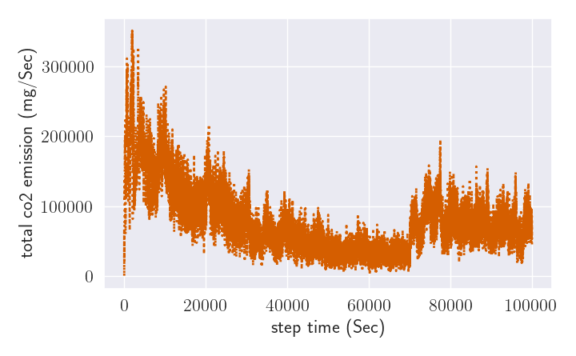
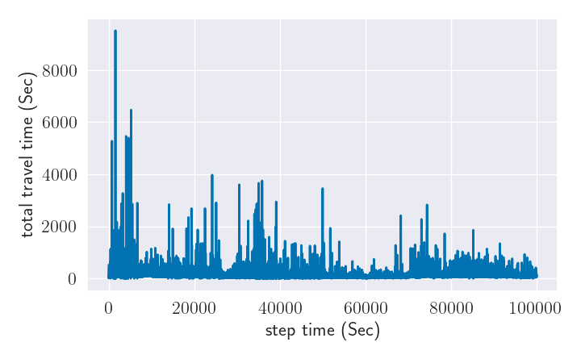
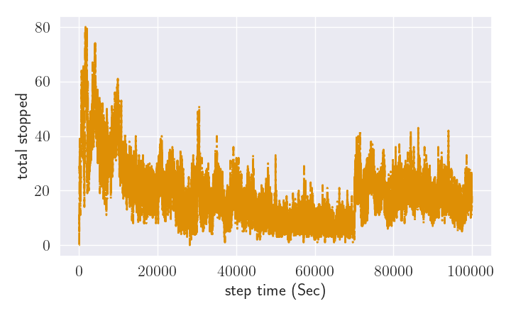
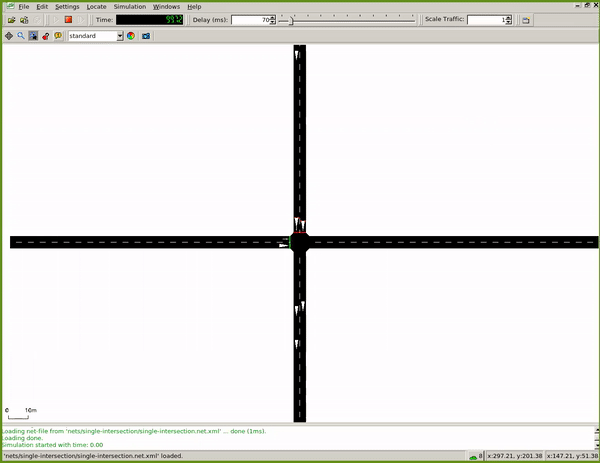
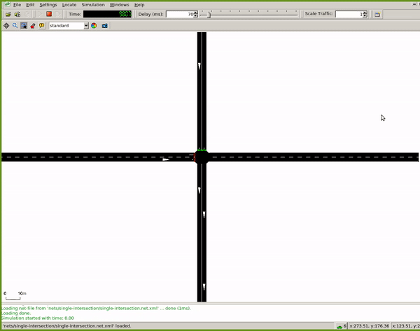
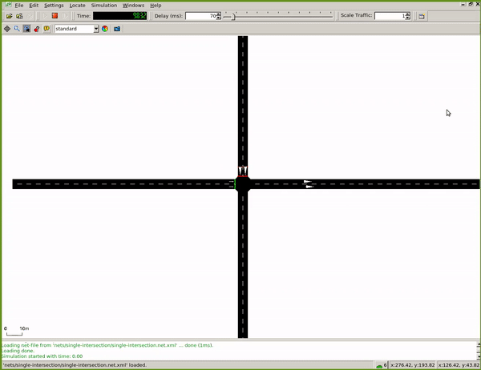
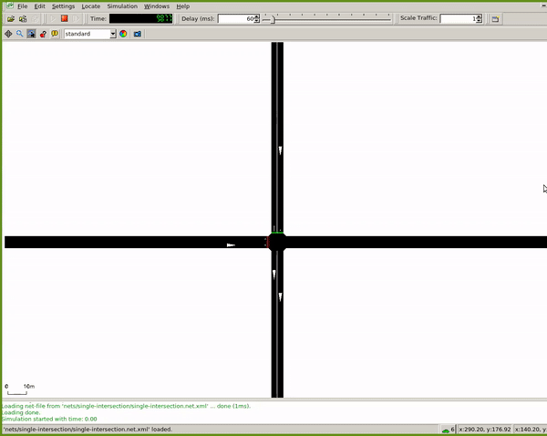

# EcoLight

EcoLight is a ecosystem friendly DRL appraoch for traffic control signal. The code is based on [SUMO-RL](https://github.com/LucasAlegre/sumo-rl)

SUMO-RL provides a simple interface to instantiate Reinforcement Learning environments with [SUMO](https://github.com/eclipse/sumo) for Traffic Signal Control. 

The main class [SumoEnvironment](/sumo_rl/environment/env.py) inherits [MultiAgentEnv](https://github.com/ray-project/ray/blob/master/python/ray/rllib/env/multi_agent_env.py) from [RLlib](https://github.com/ray-project/ray/tree/master/python/ray/rllib).  
If instantiated with parameter 'single-agent=True', it behaves like a regular [Gym Env](https://github.com/openai/gym/blob/master/gym/core.py) from [OpenAI](https://github.com/openai).  
[TrafficSignal](https://github.com/LucasAlegre/sumo-rl/blob/master/environment/traffic_signal.py) is responsible for retrieving information and actuating on traffic lights using [TraCI](https://sumo.dlr.de/wiki/TraCI) API.

Goals of this repository:
- Provide a simple interface to work with Reinforcement Learning for Traffic Signal Control using SUMO
- Support Multiagent RL
- Compatibility with gym.Env and popular RL libraries such as [stable-baselines3](https://github.com/DLR-RM/stable-baselines3) and [RLlib](https://docs.ray.io/en/master/rllib.html)
- Easy customisation: state and reward definitions are easily modifiable
- Prioritize different road users based on their CO2 emission class
- Reward shaping scheme with hyper-parameter tuning

## Install

### Install SUMO latest version:

```
sudo add-apt-repository ppa:sumo/stable
sudo apt-get update
sudo apt-get install sumo sumo-tools sumo-doc 
```
Don't forget to set SUMO_HOME variable (default sumo installation path is /usr/share/sumo)
```
echo 'export SUMO_HOME="/usr/share/sumo"' >> ~/.bashrc
source ~/.bashrc
```

### Install SUMO-RL

Stable release version is available through pip
```
pip install sumo-rl
```

or you can install using the latest (unreleased) version
```
git clone https://github.com/LucasAlegre/sumo-rl
cd sumo-rl
pip install -e .
```

Alternatively you can install it with compatible version of  Eco-Light
### Install Eco-Light
```
git clone https://github.com/pagand/eco-light
cd ecolight
pip install -e .
```

## Documentation
### SUMO simulator
[Link](https://github.com/pagand/Eco-Light/tree/master/docs/sumu)

### Eco-Light white paper
[Link](https://github.com/pagand/Eco-Light/tree/master/docs/white-paper)

### Eco-light presenation
[Link](https://upaspro.com/ecolight/)


## Examples

### General examples (SUMU-RL)

Check [experiments](/experiments) to see how to instantiate a SumoEnvironment and use it with your RL algorithm.

#### [Q-learning](/sumo-rl/agents/ql_agent.py) in a one-way single intersection:
```
python3 experiments/ql_single-intersection.py 
```

#### [RLlib A3C](/experiments/a3c_4x4grid.py) multiagent in a 4x4 grid:
```
python3 experiments/a3c_4x4grid.py
```

#### [stable-baselines3 DQN](/experiments/dqn_2way-single-intersection.py) in a 2-way single intersection:
```
python3 experiments/dqn_2way-single-intersection.py
```

### CO2-optimzed examples (Eco-Light)

#### [Q-learning](/run1_single-intersection.py) in a one-way single intersection:
```
python3 run1_single-intersection.py
```

#### [DQN](/run2_dqn_2way-single-intersection.py) in a two-way single intersection:
```
python3 run2_dqn_2way-single-intersection.py
```

#### [Q-learning](/run3_ql_2way-single-intersection.py) in a two-way single intersection:
```
python3 run3_ql_2way-single-intersection.py
```

#### [A2C](/run4_a2c_2way-single-intersection.py) in a two-way single intersection:
```
python3 run4_a2c_2way-single-intersection.py
```

#### [SARSA](/run5_sarsa_2way-single-intersection.py ) in a two-way single intersection:
```
python3 run5_sarsa_2way-single-intersection.py 
```


## Results:


#### Pressure CO2:


Total CO2 emission          |  Total travel time
:-------------------------:|:-------------------------:
|  


Total stopped time           | Total waiting time
:-------------------------:|:-------------------------:
 | 


Reward profile         | 
:-------------------------:|
 | 


#### Simulation GUI:

<table>
  <tr>
   <td>




   </td>
   <td>




   </td>
  </tr>
  <tr>
   <td>Waiting time 
   </td>
   <td>Weighted waiting time
   </td>
  </tr>
  <tr>
   <td>




   </td>
   <td>




   </td>
  </tr>
  <tr>
   <td>Queue length CO2 normalized weight
   </td>
   <td>Queue length co2 not-normalized weight
   </td>
  </tr>
  <tr>
   <td colspan="2" >


   </td>
  </tr>
  <tr>
   <td colspan="2" >Queue length type1
   </td>
  </tr>
</table>


### Cite:

```
  @article{agandecolight,
  title={EcoLight: Reward Shaping in Deep Reinforcement Learning for Ergonomic Traffic Signal Control},
  author={Agand, Pedram and Iskrov, Alexey},
  booktitle={NeurIPS 2021 Workshop on Tackling Climate Change with Machine Learning},
  year={2021}
  }
```
