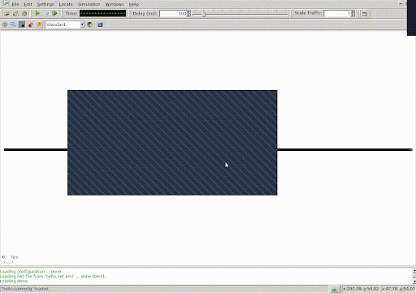
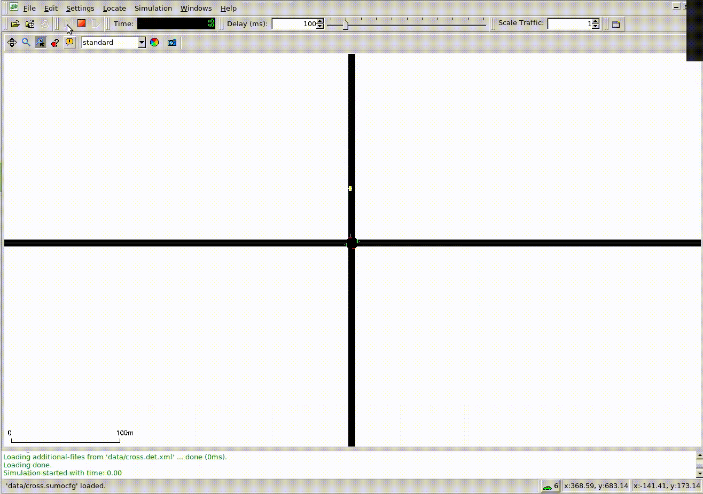
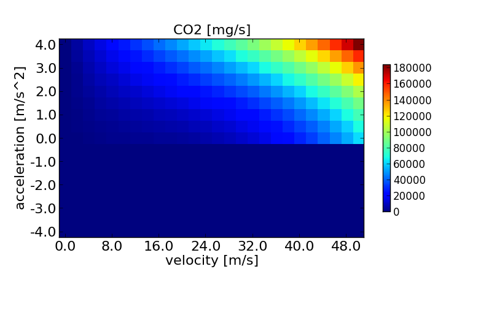
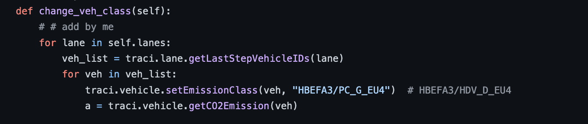

**SUMO documentation:**

In sumo a street network consists of **nodes** (junctions), **edges** (streets connecting the junctions), and **route** (traffic components). Thus, if we want to create a network with two streets, subsequent to each other, we need three nodes and two edges. 


## **Nodes**

All nodes have a location (x- and y-coordinate, describing distance to the origin in meters) and an id for future reference. Thus our simple node file looks as follows
```
<nodes>
    <node id="1" x="-250.0" y="0.0" />
    <node id="2" x="+250.0" y="0.0" />
    <node id="3" x="+251.0" y="0.0" />
</nodes>
```

It should be saved as &lt;name>.nod.xml for Sumo node files.

**Edges:**

We have a** source node** id, a **target node** id, and an **edge id** for future reference. Edges are directed, thus every vehicle travelling this edge will start at the node given in from and end at the node given in to.
```
<edges>
    <edge from="1" id="1to2" to="2" />
    <edge from="2" id="out" to="3" />
</edges>

```

It should be saved as &lt;name>.edge.xml for Sumo node files.

Now we need a shell command to create a network:

```
netconvert --node-files=hello.nod.xml --edge-files=hello.edg.xml --output-file=hello.net.xml
```

This will generate our network called &lt;name>.net.xml.

**Routes:**

Now that we have a net, we still need a car. In sumo the vehicles have types defining their basic properties such as **length**, **acceleration** and **deceleration**, and **maximum speed**. Furthermore it needs a so called sigma parameter which introduces some random behavior and is due to the car following model used. Setting it to 0 gives a deterministic car.

we define our single car mainly referring to the entries before and giving it a departure time as in the following &lt;name>.rou.xml
```
<routes>
    <vType accel="1.0" decel="5.0" id="Car" length="2.0" maxSpeed="100.0" sigma="0.0" />
    <route id="route0" edges="1to2 out"/>
    <vehicle depart="1" id="veh0" route="route0" type="Car" />
</routes>
Configuration:
<configuration>
    <input>
        <net-file value="hello.net.xml"/>
        <route-files value="hello.rou.xml"/>
    </input>
    <time>
        <begin value="0"/>
        <end value="10000"/>
    </time>
</configuration>
```

Saving this to hello.sumocfg we can start the simulation by either
```

sumo -c hello.sumocfg

sumo-gui -c hello.sumocfg
```

**Definition of vehicle and routes:**

it is important to know that a vehicle in SUMO consists of three parts:


* a vehicle type which describes the vehicle's physical properties,
* a route the vehicle shall take,
* and the vehicle itself.

Any vehicle types or routes referenced by the attributes type or route must be defined before they are used.

```
<vehicle id="veh0"  depart="1" route="route0" type="type0" />
<vType id="type0" accel="1.0" length="2.0" maxSpeed="10.0" sigma="0.0" />
<route id="route0" edges="1to2 out"/>
```


## **Repeated vehicles (Flows):**

It’s possible to have multiple vehicle which have the same parameters as the vehicle except for the departure time.

```
flow id="flow0" color="1,0,0"  begin="3" end= "500" period="50" type="type0" route="route0" />
```

The id of the created vehicles is "flowId.runningNumber" and they are distributed either equally or randomly in the given interval. 

**Trip:**

Demand information for the simulation may also take the form of origin and destination edges instead of a complete list of edges. 

```
trip id="t" depart="0" from="beg" to="end"/>
```


# **Vehicle Types**

A vehicle is defined using the vType-element

This definition is the initial one which includes both, the definition of the vehicle's "**purely physical**" parameters, such as its length, its color, or its maximum velocity, and also the used car-following model's parameters. Please note that even though the car-following parameters are describing values such as max. acceleration, or max. deceleration, they mostly do not correspond to what one would assume. The maximum acceleration for example is not the car's maximum acceleration possibility but rather the maximum acceleration a driver choses - even if you have a Jaguar, you probably are not trying to go to 100km/h in 5s when driving through a city.

Available attributes:


<table>
  <tr>
   <td><strong>id</strong>
   </td>
   <td>The name of the vehicle type
   </td>
  </tr>
  <tr>
   <td>accel
   </td>
   <td>The acceleration ability of vehicles of this type
   </td>
  </tr>
  <tr>
   <td>sigma
   </td>
   <td>Car-following model parameter
   </td>
  </tr>
  <tr>
   <td>length
   </td>
   <td>The vehicle's <strong>netto</strong>-length
   </td>
  </tr>
  <tr>
   <td>vClass
   </td>
   <td>By default vehicles represent regular passenger cars.
   </td>
  </tr>
  <tr>
   <td>emissionClass
   </td>
   <td>By default a gasoline passenger car conforming to emission standard <em>EURO 4</em> is used.
   </td>
  </tr>
  <tr>
   <td>guishape
   </td>
   <td>For illustration, default passenger.
   </td>
  </tr>
</table>


one can find definitions of the assigned vehicles' shapes, emissions, and assignment to abstract vehicle classes. 

A SUMO vehicle may be assigned to an "abstract vehicle class", defined by using the attribute vClass. These classes are used in lane definitions and allow/disallow the usage of lanes for certain vehicle types. One may think of having a road with three lanes, where the rightmost may only be used by "taxis" or "buses". The default vehicle class is **passenger** (denoting normal passenger cars).

**emissionClass:**

SUMO includes the following emission models:


* [HBEFA v2.1-based](https://sumo.dlr.de/docs/Models/Emissions/HBEFA-based.html): A continuous reformulation of the[ HBEFA](http://www.hbefa.net/) v2.1 emissions data base (open source);
* [HBEFA v3.1-based](https://sumo.dlr.de/docs/Models/Emissions/HBEFA3-based.html): A continuous reformulation of the[ HBEFA](http://www.hbefa.net/) v3.1 emissions data base (open source);
* [PHEMlight](https://sumo.dlr.de/docs/Models/Emissions/PHEMlight.html), a derivation of the original[ PHEM](https://www.ivt.tugraz.at/en/research/areas/em/) emission model (closed source, commercial).
* [Electric Vehicle Model](https://sumo.dlr.de/docs/Models/Electric.html#emission_output): an electricity-consumption model by[ Kurczveil, T., López, P.A., Schnieder](https://sumo.dlr.de/docs/Models/Electric.html#publications).

The default is HBEFA3/PC_G_EU4 (a gasoline powered Euro norm 4 passenger car modeled using the HBEFA3 based model).


<table>
  <tr>
   <td>Bus
   </td>
   <td>average urban bus (all fuel types)
   </td>
  </tr>
  <tr>
   <td>HDV
   </td>
   <td>average heavy duty vehicle (all fuel types)
   </td>
  </tr>
  <tr>
   <td>HDV_G
   </td>
   <td>average gasoline driven heavy duty vehicle
   </td>
  </tr>
  <tr>
   <td>HDV_D_EU4
   </td>
   <td>diesel driven heavy duty vehicle Euro norm 4
   </td>
  </tr>
  <tr>
   <td>zero
   </td>
   <td>zero emission vehicle
   </td>
  </tr>
  <tr>
   <td>LDV_G_EU4
   </td>
   <td>gasoline driven light duty vehicle Euro norm 4
   </td>
  </tr>
  <tr>
   <td>LDV_D_EU4
   </td>
   <td>diesel driven light duty vehicle Euro norm 4
   </td>
  </tr>
  <tr>
   <td>PC
   </td>
   <td>average passenger car (all fuel types)
   </td>
  </tr>
  <tr>
   <td>PC_G_EU4
   </td>
   <td>gasoline driven passenger car Euro norm 4
   </td>
  </tr>
  <tr>
   <td>PC_D_EU4
   </td>
   <td>diesel driven passenger car Euro norm 4
   </td>
  </tr>
</table>





**TraCI4Traffic Light:**

This shows how to use the Traffic Control Interface (in short TraCI) on a simple example. TraCI gives the possibility to control a running road traffic simulation. TraCI uses a TCP-based client/server architecture where SUMO acts as a server and the external script (the “controller”) is the client. In this tutorial the “controller” is a Python-Script which receives information about the simulation state from the server and then sends instructions back.

Before we start we define a traffic light node:

```
node id="0" x="0.0" y="0.0"  type="traffic_light"/>
```

Then we define 4 nodes for 2 way intersection plus (id; 51,52,53,54) and four starting points nodes (id; 1,2,3,4)

In our rout file we define two vtype one for WE and one for NS

```
<vType id="typeWE" accel="0.8" decel="4.5" sigma="0.5" length="5" minGap="2.5" maxSpeed="16.67" \
guiShape="passenger"/>
       <vType id="typeNS" accel="0.8" decel="4.5" sigma="0.5" length="7" minGap="3" maxSpeed="25" guiShape="bus"/>

```

We have 3 routs right,left,down

```
<route id="right" edges="51o 1i 2o 52i" />
<route id="left" edges="52o 2i 1o 51i" />
<route id="down" edges="54o 4i 3o 53i" />

```


We try to consider a priority for the NS vehicle, so the traffic is always green for the WE traffic unless an “emergency” vehicle showed up in the NS; they can immediately go without stop.

The normal way to use traci for sumo is to start it as a subprocess and then the python script connects and run:
```
traci.start([sumoBinary, "-c", ",&lt;address to sumocfg>",

                        "--tripinfo-output", "tripinfo.xml"]
```
Where sumoBinary is actually sumo-gui. And tripinfo actually creates a  record of cars spawn and actions. 

 

We strat with phase 2 in the intersection where the EW is green:
```

traci.trafficlight.setPhase("0", 2)
```

 We can also read the current phase by:
 ```

 traci.trafficlight.getPhase("0")
 ```

We use this command to simulate the scenario for one time step:
```
traci.simulationStep()
```
We can understand if the emergency car is showed up using the induction loop
```
traci.inductionloop.getLastStepVehicleNumber
```

Which return the if of the vehicle, if it is greater than zero, it means there is someone passing by. 

After the simulation, we use 
```
traci.close()

```





RLlib:

RLlib is an open-source library for reinforcement learning that offers both high scalability and a unified API for a variety of applications. RLlib natively supports TensorFlow, TensorFlow Eager, and PyTorch, but most of its internals are framework agnostic.


Stable Baseline:

Stable Baselines is a set of improved implementations of reinforcement learning algorithms based on OpenAI. 

Some algorithms (like PPO2) are capable of running in GPU.

The network architecture is Tensorflow.

Stable Baseline3:

Stable Baselines3 (SB3) is a set of reliable implementations of reinforcement learning algorithms in PyTorch.

Stable-Baselines3 supports PyTorch 1.4+ and python 3.6+

```

1. import gym
2. 
3. from stable_baselines3 import PPO
4. 
5. env = gym.make("CartPole-v1")
6. 
7. model = PPO("MlpPolicy", env, verbose=1)
8. model.learn(total_timesteps=10000)
9. 
10. obs = env.reset()
11. for i in range(1000):
12.     action, _states = model.predict(obs, deterministic=True)
13.     obs, reward, done, info = env.step(action)
14.     env.render()
15.     if done:
16.       obs = env.reset()
17. 
18. env.close()
```
Get the current emission:

Here is the map:





And this is the api from Traci:
```
sum([ traci.lane.getCO2Emission(lane)  for lane in self.lanes])
```

**SUMO-RL: **

State: a vector containing the traffic light phases with density and number of queue for each lane

E.g. in  a 2 way intersection with one traffic light, the state vector has 9 elements. 

For phases it uses one-hot encoded
```
phase_id = [1 if self.phase//2 == i else 0 for i in range(self.num_green_phases)]
```


Density is the number of vehicle is a specific lane divided by the total number of vehicle that can fit in that lane:
```
traci.lane.getLastStepVehicleNumber(lane)
```
Returns the number of vehicles that were on the named induction loop within the last simulation step [#];

Lane queue is the ratio of number of cars that are halted to the total number of cars that can stop in the lane
```
traci.lane.getLastStepHaltingNumber(lane)
```

The problem with travel time:
```
traci.lane.getTraveltime
```
Compute the travel time using the following relation: length/ave_speed

The problem is that, if a lane has no moving vehicle, there would be a large value for travel time.

Solution: we redefine the travel time:

Travel_time = ( <span style="text-decoration:underline;">L</span> * N_t)/(sum [ <span style="text-decoration:underline;">V</span>_{lt}* N_{lt}])

<span style="text-decoration:underline;">L</span>: average trip length
```
traci.lane.getLength(lane)
```

N_t: total num of cars in last step

<span style="text-decoration:underline;">V</span>_{lt}: average velocity of lane l at last step
```
traci.lane.getLastStepMeanSpeed(lane)
```
N_{lt}: total num of cars of lane l in last step
```
traci.lane.getLastStepVehicleNumber(lane)
```
The speed is considered to be 50 km/h or 13.9 m/s. The average trip length is 300 m. Hence, the fastest travel time is 21.58 Sec.

You can get the current emitted co2 from each vehicle directly via:
```
[ traci.vehicle.getCO2Emission(veh)  for veh in self.env.vehicles])
```
Available approaches to change the emission class:

1- using the attributes in vType


```
<routes>
    <vType id="type1" length="5" maxSpeed="70" emissionClass="HBEFA3/Bus" carFollowModel="Krauss" accel="2.6" decel="4.5" sigma="0.5"/>
</routes>
```


Generally we have:


```
emissionClass="<model>/<class>"
```


For the model [HBEFA v3.1-based](https://sumo.dlr.de/docs/Models/Emissions/HBEFA3-based.html) we have:


<table>
  <tr>
   <td>Bus
   </td>
   <td>average urban bus (all fuel types)
   </td>
  </tr>
  <tr>
   <td>Coach
   </td>
   <td>average long distance bus (all fuel types)
   </td>
  </tr>
  <tr>
   <td>HDV
   </td>
   <td>average heavy duty vehicle (all fuel types)
   </td>
  </tr>
  <tr>
   <td>HDV_D_EU4
   </td>
   <td>diesel driven heavy duty vehicle Euro norm 4
   </td>
  </tr>
  <tr>
   <td>zero
   </td>
   <td>zero emission vehicle
   </td>
  </tr>
  <tr>
   <td>LDV
   </td>
   <td>average light duty vehicles (all fuel types)
   </td>
  </tr>
  <tr>
   <td>PC
   </td>
   <td>average passenger car (all fuel types)
   </td>
  </tr>
  <tr>
   <td>PC_G_EU4
   </td>
   <td>gasoline driven passenger car Euro norm 4 (default)
   </td>
  </tr>
</table>


Flow is used when we want repeated vehicle (same as sumo-rl)

It is possible to define repeated vehicle emissions ("flow"s), which have the same parameters as the vehicle or trip definitions except for the departure time. The id of the created vehicles is "flowId.runningNumber" and they are distributed either equally or randomly in the given interval. 


<table>
  <tr>
   <td>begin/end
   </td>
   <td>first/last vehicle departure time
   </td>
  </tr>
  <tr>
   <td>vehsPerHour
   </td>
   <td>number of vehicles per hour, equally spaced (not together with period or probability)
   </td>
  </tr>
  <tr>
   <td>period
   </td>
   <td>insert equally spaced vehicles at that period (not together with vehsPerHour or probability)
   </td>
  </tr>
  <tr>
   <td>probability
   </td>
   <td>probability for emitting a vehicle each second (not together with vehsPerHour or period)
   </td>
  </tr>
  <tr>
   <td>number
   </td>
   <td>total number of vehicles, equally spaced
   </td>
  </tr>
</table>


The second approach is by using tracI:

Changing vehicle type state

Run-time execution

traci.vehicle.setEmissionClass(vehid,”HBEFA3/Bus”)

Given the vehicles that are launched to the simulation, we can set them to be in a different class using this code:

I defined a method in the class, which go through each id of vehicles and set their emission class:





The problem with this is that, traci is applied to the simulation after each simulation step. Hereby, during the time, the vehicle is launched already but the traci is able to change the class only after a certain time, when the step time arrives.

So when we set the emission class to zero for all the vehicles, the total emitted co2 is not exactly zero, it’s something around 3000 which is not what we want!!

I have add four different type of vehicle and currently integrating two of passenger car and truck (HDV) into concurrent flow. In the simulation, sometimes there would be a collision between 2 vehicles, but it omits one of them

    ```
    <vType id="electric" emissionClass="zero" color="1,0,0" accel="0.8" decel="4.5"/>  <!--HBEFA3/Bus-->
<vType id="bus" emissionClass="HBEFA3/Bus" color="0,1,0" accel="0.4" decel="2.2"/>  <!--Bus-->
<vType id="truck" emissionClass="HBEFA3/HDV" color="0,0,1" accel="0.3" decel="2"/>  <!--heavy duty-->
<vType id="car"  color="1,1,1" accel="0.8" decel="4.5" />  <!--HBEFA3/Bus-->
<flow id="flow_nsc" route="route_ns" type="car" begin="0" end="100000" probability="0.1" departSpeed="max" departPos="base" departLane="best"/>
<flow id="flow_wec" route="route_we" type="car" begin="0" end="100000" probability="0.4" departSpeed="max" departPos="base" departLane="best"/>
<flow id="flow_nst" route="route_ns" type="truck" begin="0" end="100000" probability="0.02" departSpeed="max" departPos="base" departLane="best"/>
<flow id="flow_wet" route="route_we" type="truck" begin="0" end="100000" probability="0.05" departSpeed="max" departPos="base" departLane="best"/>
  ```

We compute the normalized lane emission as follows, 

     ```
    [ max(0,min(1,(traci.lane.getCO2Emission(lane)-self.vehicle_base_co2) / vehicle_base_max/
                  max(1,traci.lane.getLastStepVehicleNumber(lane)))) for lane in self.lanes]
     ```

Duration of the simulation is 11000 sec with two flows and some constant vehicle randomly.

       ```
    <flow id="flow_nsc1" route="route_ns" type="car" begin="9918" end="11000" period="14" departSpeed="max" departPos="base" departLane="best"/>
<flow id="flow_wec1" route="route_we" type="car" begin="9999" end="11000" period="13" departSpeed="max" departPos="base" departLane="best"/>
       ```

Compute the vehicle lane weight based on the type:

In here we consider an additional value (count) for truck or any other vehicle other than passenger. Then compute the normalized value for each lane

```
weights = []
for lane in self.lanes:
   count = 0
   veh_list = traci.lane.getLastStepVehicleIDs(lane)
   for veh in veh_list:
       if traci.vehicle.getEmissionClass(veh) == "HBEFA3/HDV":
           count += 10
   weights.append((len(veh_list)+count)/max(1,len(veh_list)))
return weights
    ```

Add a flow of bus as follows:

    ```
flow id="flow_nst" route="route_ns" type="bus" begin="0" end="11000" period="20" departSpeed="max" departPos="base" departLane="best"/>
    ```

We use stable baseline3 for the DRL approach

I add the following code to run from the pretrained model

And also at the end, we ask if it wants to save the model:

```
prs.add_argument("-pretrain", action="store_true", default=False, help="Do you want to use pretained model?\n")

args = prs.parse_args()

if args.pretrain:
   model = DQN.load("outputs/last_saved_dqn_2way")
   model.set_env(env)
   model.learn(total_timesteps=100000)
else:
   model.learn(total_timesteps=100000)


save_model = input('Do you want to save model (Y/N) ?')
if save_model == 'Y':
   model.save("outputs/last_saved_dqn_2way")

env.close()
```

### Effect of co2 emission

After 100,000 step run in 2 way intersection:


<table>
  <tr>
   <td>vehicle
   </td>
   <td>Co2 emission (50km/h)
   </td>
  </tr>
  <tr>
   <td>PC_G_EU4
   </td>
   <td>0.31*10^5
   </td>
  </tr>
  <tr>
   <td>HDV_D_EU4
   </td>
   <td>1.51*10^5
   </td>
  </tr>
  <tr>
   <td>BUS
   </td>
   <td>1.38*10^5
   </td>
  </tr>
</table>


Co2: (0-50 km/h)


<table>
  <tr>
   <td>Vehicle type
   </td>
   <td>Stop cost *10^5
   </td>
   <td>Idle cost *10^5
   </td>
   <td>Ratio stop/idle
   </td>
  </tr>
  <tr>
   <td>PC_G_EU4
   </td>
   <td>55.8
   </td>
   <td>0.408
   </td>
   <td>137
   </td>
  </tr>
  <tr>
   <td>HGV
   </td>
   <td>562
   </td>
   <td>1.26
   </td>
   <td>446
   </td>
  </tr>
  <tr>
   <td>BUS
   </td>
   <td>333
   </td>
   <td>1.56
   </td>
   <td>213
   </td>
  </tr>
</table>


Nox (50 km/h)


<table>
  <tr>
   <td>Vehicle type
   </td>
   <td>Stop cost *10^5
   </td>
   <td>Idle cost*10^5
   </td>
   <td>Ratio stop/idle
   </td>
  </tr>
  <tr>
   <td>PC_G_EU4
   </td>
   <td>0.36
   </td>
   <td>0.67
   </td>
   <td>474
   </td>
  </tr>
  <tr>
   <td>HGV
   </td>
   <td>2.26
   </td>
   <td>13.3
   </td>
   <td>169
   </td>
  </tr>
  <tr>
   <td>BUS
   </td>
   <td>1.64
   </td>
   <td>21.3
   </td>
   <td>76.9
   </td>
  </tr>
</table>

